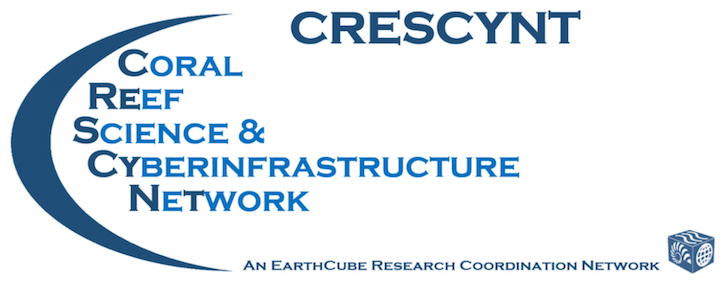

# WELCOME to Data Science for Coral Reefs!

### Main website for the workshop: https://nceas.github.io/crescynt-training/

Instructors: 

- Julien Brun — twitter & github: @brunj7
- Jeanette Clark — t: @sjeanetteclark, g: @jeanetteclark
- Julie Stewart Lowndes — t: @juliesquid, g: @jules32

In the workshop we'll use **sticky notes** to indicate whether everything is OK (blue) or not (pink).

**If you've successfully done the following, please put a blue sticky note up on your laptop.** 

1. **R**: Download and install (most recent version is 3.4.3): https://cloud.r-project.org
1. **RStudio**: Download and install (most recent version is 1.1423): http://www.rstudio.com/download
1. **Github**: Create an account: https://github.com Note! *Shorter names that kind of identify you are better, and use your work email!*

----

[Google Doc Link](https://docs.google.com/document/d/1UaKHPpz3cgcwUrY_M68zGfahmewdLuPMRQUJJZFiKRg/edit#)

  
 

  
 

  
 This work is licensed under a <a rel="license" href="http://creativecommons.org/licenses/by-sa/4.0/">Creative Commons Attribution-ShareAlike 4.0 International License</a>. 

