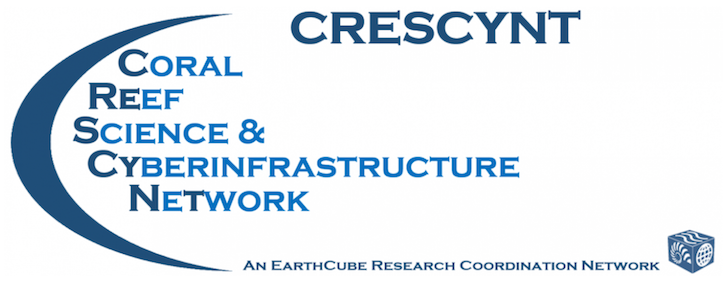

```{r setup, include=FALSE, message=FALSE, warning=FALSE}
knitr::opts_chunk$set(echo = TRUE)
```

<br>

<br>

# Welcome

Welcome to [CRESCYNT](https://www.earthcube.org/group/crescynt-coral-reef-science-cyberinfrastructure-network)'s [**Data Science for Coral Reefs Workshop 1: Data Rescue**](http://crescyntblog.org/2017/12/22/crescynt-workshop-1-data-rescue), hosted at [NCEAS](https://nceas.ucsb.edu/) in Santa Barbara, California, from March 12-15, 2018.  

This workshop will cover the basic principles of data archiving and data repositories, metadata formats, how to write good metadata, how to archive data on the [KNB data repository](http://knb.ecoinformatics.org/) and elsewhere, data preservation workflow and best practices, and how to improve data discoverability and reusability. Additionally, participants will spend approximately 2 days working in pairs to archive their own data using these principles.

 

## Workshop schedule 

```{r, echo=FALSE, child="data-rescue-schedule.Rmd"}
```

## Prerequisites

Prepare the data you are planning to archive!!

<br />

   


