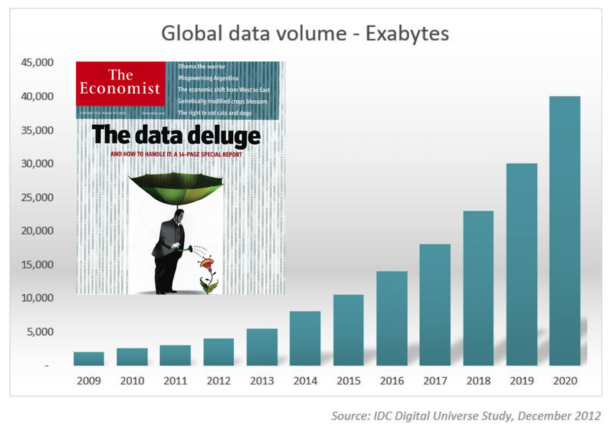
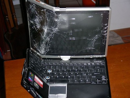

```{r echo = FALSE}
knitr::opts_chunk$set(echo = FALSE)
```

## The Need for Data Management: Data Deluge

```{r}

```


## Benefits for Your Own Research

- Keep yourself organized
- Avoid data loss
- Better control versions of data
- Format and document your data for your own recollection, accountability, and re-use
- Gain credibility and recognition for your science efforts through data sharing!
- Capture your science processes to make them reproducible


## Benefits for the Scientific Community

- Data is a valuable asset 
- Data should be managed to:
  - Maximize the effective use and value of data
  - Continually improve the quality (accuracy, integrity, integration,...) 
  - Ensure appropriate use of data and information
  - Facilitate data sharing 
  - Ensure sustainability and accessibility in long term for re-use in science


## Data Life Cycle

The data life cycle provides a high level overview of the stages involved in successful management and preservation of data for use and reuse.

```{r}
knitr::include_graphics("images/DLC.png")
```


## Data Management Plans (DMP)

A data managment plan describes how you will manage your data during the lifetime of a reserach project.


## Why doing a DMP?

For any scientific project, it is good practice to prepare a data management plan (DMP). The process of creating your DMP will force you to think about potential issues realted to the project's data that could affect timeline, costs and personel needed.

>- It might be required by founding agency
>- It will help you in your project planning and ressources allocations
>- It will help you to share and promote your work (Publications, Data citation, ...)


## Don't loose your data

*Accidents happen !!!*

 


## Document: Sooner the Better

Document and preserve your data when you are actively analyzing them! 

```{r fig.cap = "Adapted from Michener et al, 1997"}
knitr::include_graphics("images/DLC.png")
```

<div class="notes">
At this time, it is the easiest for you to document and preserve your project’s data, because you know and understand the most about them. Then slowly, or more rapidly due to life events and technology shifts, what you know about the data declines.
</div>


## Document Soon, it is also for yourself {.build}

You would not have to remember:

- The name of that file?
- The directory where you put it?
- The units those measurements were taken in?
- Which sample site was which?
- Is it the cleaned version of the dataset used for publication?

=> Easier to share with others, good for collaborations!


## Not only Data

We mainly have beeing talking about data, but these rules apply to all the scientific processes and products genereated by a reasearch project, including:

- Your scientific workflow
- Your scripts developed to manipulate and analyse the data
- The models the tools you used or developed


## Resources used:

- DataONE, Data Life Cycle: https://www.dataone.org/data-life-cycle
- DataONE data management guide: https://www.dataone.org/sites/all/documents/DataONE-PPSR-DataManagementGuide.pdf
- ESIP, Data Management Plans: http://commons.esipfed.org/datamanagementshortcourse (benefits slides were adapted from this material)
- Borer, Elizabeth T., Eric W. Seabloom, Matthew B. Jones, and Mark Schildhauer. (2009) "Some Simple Guidelines for Effective Data Management." The Bulletin of the Ecological Society of America 90, no. 2: 205-14. https://doi.org/10.1890/0012-9623-90.2.205.
- Michener, W. K. (2015). Ten Simple Rules for Creating a Good Data Management Plan. PLoS Comput Biol , 11(10). presented at the 10/2015.  https://doi.org/10.1371/journal.pcbi.1004525
