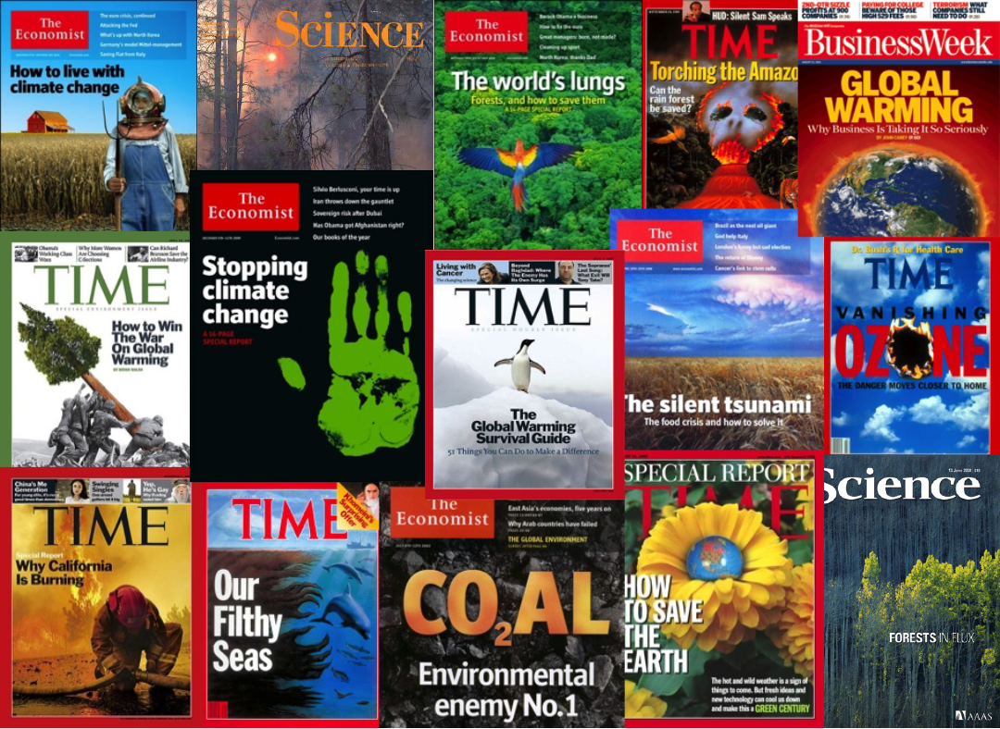

# Why Manage Data?

## The Need for Data Management: Big Data

## The Need for Data Management: Data Deluge

## The Need for Data Management: Data Entropy

 

## The Need for Data Management: Public Perception

***

  

*"The climate scientists at the centre of a media storm over leaked emails were yesterday cleared of accusations that they fudged their results and silenced critics, but a review found they had failed to be open enough about their work."*

## For Your Own Research

>- Keep yourself organized – be able to find your files (data inputs, analytic scripts, outputs at various stages of the analytic process, etc.) 
- Track your science processes for reproducibility – be able to match up your outputs with exact inputs and transformations that produced them
- Better control versions of data – easily identify versions that can be periodically purged
- To avoid data loss (e.g. making backups)
- Format your data for re-use (by yourself or others)
- Be prepared: Document your data for your own recollection, accountability, and re-use (by yourself or others) 
- Gain credibility and recognition for your science efforts through data sharing!

## For the Scientific Community

- Data is a valuable asset – it is expensive and time consuming to collect 
- Data should be managed to:
  - maximize the effective use and value of data and information assets
  - continually improve the quality including: data accuracy, integrity, integration, timeliness of data capture and presentation, relevance, and usefulness
  - ensure appropriate use of data and information
  - facilitate data sharing
  - ensure sustainability and accessibility in long term for re-use in science

# Data Life Cycle

The data life cycle provides a high level overview of the stages involved in successful management and preservation of data for use and reuse.

 

## Data Management Plans (DMP)

A data managment plan describes how you will manage your data during the lifetime of a reserach project.

## Why doing a DMP?

For any scientific project, it is good practice to prepare a data management plan (DMP). The process of creating your DMP will force you to think about potential issues realted to the project's data that could affect timeline, costs and personel needed.

>- It might be required by founding agency
>- It will help you in your project planning and ressources allocations
>- It will help you to share and promote your work (Publications, Data citation, ...)

## Don't loose your data

*Accidents happen !!!*

 

## Document your data right away

Document and preserve your data when you are actively working on them! 

This is the time at which you know and understand most about your project’s data, therefore when it is the easiest for you to document and preserve them. Then slowly or more rapidly due to time and life events, what you know about the data declines to zero eventually. 

## Document your data right away

It is also for your furture you, you would not have to remember:

>- the name of that file?

>- the directory where you put it?

>- the units those measurements were taken in?

>- which sample site was which?

>- Is it the cleaned version?

## Not only Data

We mainly have beeing talking about data, but these rules apply to all the scientific processes and products genereated by a reasearch project, including:
>- the scientific workflow
>- the scripts developed to manipulate and analyse the data
>- the models the tools you used or developed

