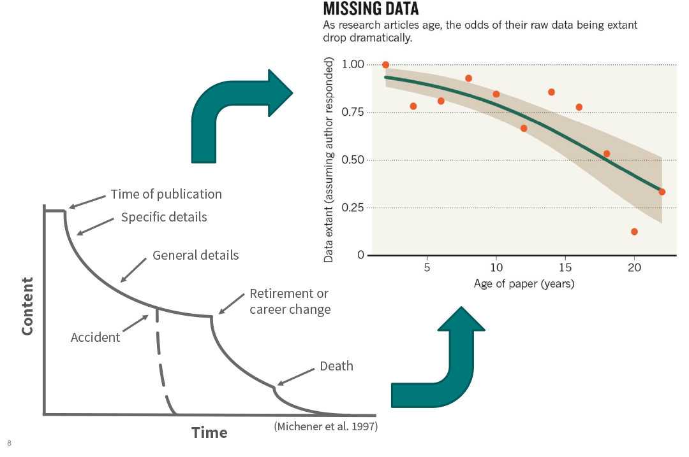
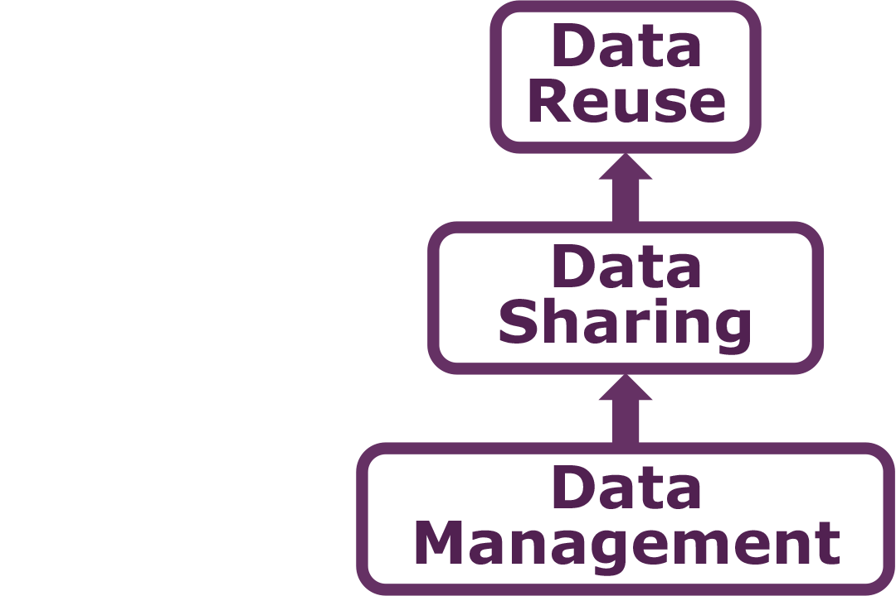

Data Management
========================================================
width: 1440
height: 900
font-family: 'Gill Sans', 'Source Sans Pro', 'Aller', 'Helvetica'
css: ../course-overview/oss.css

# And Data Repositories

The Need for Data Management: Big Data
========================================================

The Need for Data Management: Data Deluge
========================================================

The Need for Data Management: Data Entropy
========================================================
 

The Need for Data Management: Public Perception
========================================================

***
  

*"The climate scientists at the centre of a media storm over leaked emails were yesterday cleared of accusations that they fudged their results and silenced critics, but a review found they had failed to be open enough about their work."*

Why Manage Data? Researcher Perspective
========================================================
- Keep yourself organized – be able to find your files (data inputs, analytic scripts, outputs at various stages of the analytic process, etc.) 
- Track your science processes for reproducibility – be able to match up your outputs with exact inputs and transformations that produced them
- Better control versions of data – easily identify versions that can be periodically purged
- Quality control your data more efficiently
- To avoid data loss (e.g. making backups)
- Format your data for re-use (by yourself or others)
- Be prepared: Document your data for your own recollection, accountability, and re-use (by yourself or others) 
- Gain credibility and recognition for your science efforts through data sharing!

Why Manage Data? Advancement of Science
========================================================
- Data is a valuable asset – it is expensive and time consuming to collect 
- Data should be managed to:
  - maximize the effective use and value of data and information assets
  - continually improve the quality including: data accuracy, integrity, integration, timeliness of data capture and presentation, relevance, and usefulness
  - ensure appropriate use of data and information
  - facilitate data sharing
  - ensure sustainability and accessibility in long term for re-use in science

The Data Life Cycle
========================================================
 

The Data Life Cycle
========================================================
 

========================================================
 

Barriers to Synthesis
========================================================
- Data not preserved
  - Tiny proportion of ecological data are readily available
- Dispersed, isolated repositories
  - Each community has its own; disconnected; underutilized
- Lack of software interoperability
  - Metacat, DSpace, Mercury, iRODS, XMCat, OPeNDAP, ...
- Heterogeneous data
  - Many data formats, metadata formats, and varying semantics
  
Solutions
========================================================
- Preserve data
- Adopt standards
- Create networks
- Create interoperable software

Data Repositories - Key Features
========================================================
- Datasets are preserved with long-term commitment
- Datasets are versioned and citeable
- Datasets are searchable and discoverable

Data Repositories
========================================================
 
 

Data Repositories
========================================================
 
 

========================================================

Every community has ...

- many data schemas
  - one for each project and person
- many data formats
  - ASCII, NetCDF, HDF, GeoTiff, ...
- many metadata schemas
  - Biological Data Profile, Darwin Core, Dublin Core, <strong>Ecological Metadata Language (EML)</strong>, Open GIS schemas, ISO Schemas, ...

Accepting this heterogeneity is critical

