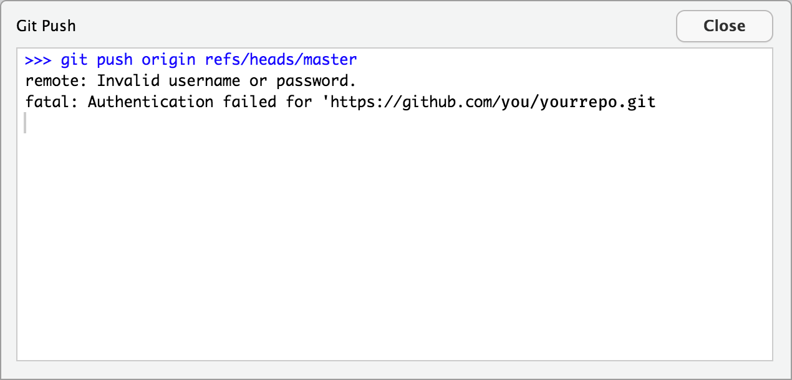

# GitHub 2FA Issues

So you're getting this error in RStudio about an "Invalid username or password" when you push:

What do you do? This is usually caused by using what's called [Two-Factor Authentication](https://help.github.com/articles/securing-your-account-with-two-factor-authentication-2fa/) (or 2FA). 2FA is awesome and you should probably be using is so go you! But to fix your issue with pushing, you have two options:

1. Generate a Personal Access Token (PAT) using [GitHub's instructions](https://help.github.com/articles/creating-a-personal-access-token-for-the-command-line/) and use it insetad of your password when RStudio prompts you or,
2. Use SSH instead of HTTPS. Follow this guide: http://happygitwithr.com/ssh-keys.html

Method (2) is preferable in most scenarios but (1) may be more straightforward for some users.
