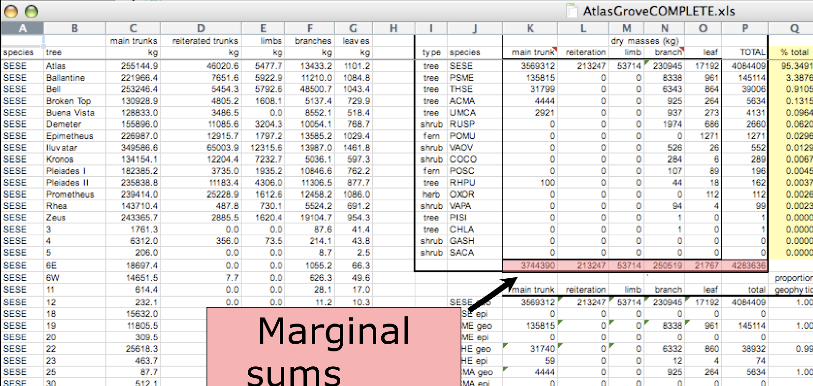
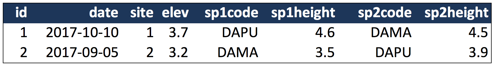
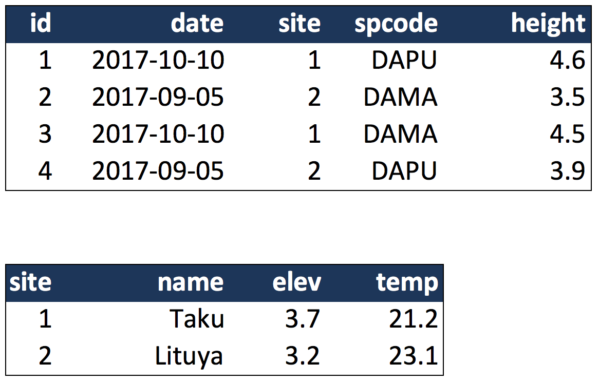

# Data Modeling & Tidy Data

## Learning Objectives

- Understand basics of data models
- Learn how to design and create effective data tables

## Benefits of normalized or "tidy" data 

- Powerful search and filtering
- Handle large and/or complex data sets
- Help to enforce data integrity
- Easier to handle data updates

. . . 

*=> Easier to conduct your Analysis and even so for others!!*


## Data Heterogeneity

Data are heterogeneous in:

>- Structure (schema)
   - Logical model of the data (e.g., tables, hierarchical trees, raster images, etc.)
>- Semantics
   - Specific meaning of the data (e.g., nature and types of measurements, importance of contextual information, interpretation of record structure, etc.): documentation
>- Syntax
   - Digital format of the data (e.g., csv, “R dataframe”, NetCDF, Excel XLSX, DBF, etc.)


## Why Tabular Data?

Spreadsheets are (still) the primary data entry tool of the digital age!


## Spreadsheets

 *the Good*:

- Quick on the draw (clickety-click and you’re ready for action)
- Always there (on most everyone’s computer)
- Smarter than he lets on (stats, pivot tables, VB scripts)
- Cleans up real pretty (graphics, fonts, colors, borders)


## Spreadsheets

 *the Bad*:

- Also a fast shooter  (click&fire)
- No scruples (delete row, click, ctrl-x/ctrl-c, re-sort, save)
- Talks a good story, but unreliable (e.g. http://www.practicalstats.com/xlsstats/excelstats.html)


## Spreadsheets

 *the Ugly*:

- Ill-mannered: takes your data prisoner; conflates raw data with summary data
- Gaudy: Use of visual cues– color, font, borders– to indicate critical metadata or other semantic tidbits
- Shifty:  Cross-linking of worksheets sets up “invisible” dependencies
- Shiftless: Provenance is entirely lost
- The more complicated your Spreadsheet, the UGLIER it gets in terms of using it with other software

. . . 

*_=>  Encourages you to mix your data and your analaysis_*


## Data Organization


## Multiple tables


## Inconsistent observations


## Inconsistent variables


## Marginal sums and statistics



. . . 

*_=>  A Spreadsheet is not a table !!*


# Good enough data modeling

## Terminological Soup

Table = Relation = Data set   (~ Worksheet) 

Column = Variable = Attribute = Characteristic

Row = Record = Tuple  <> Observation (eek)

Keys are used to Join or Merge

Cell = Value = Measurement (“Observation”)

Data Model = Schema


## Denormalized data

- Observations about different entities combined



In the above example, each row has measurements about both the `site` at which observations
occurred, as well as observations of two individuals of possibly different species
found at that site.  This is *not normalized* data.

People often refer to this as *wide* format, because the observatiions are spread across a
wide number of columns.  Note that, should one encounter a new species in the survey, we
wold have to add new columns to the table.  This is difficult to analyze, understand, and
maintain.

## Tabular data

__Observations__. A better way to model data is to organize the observations about each type of entity in its own table.  This results in:

- Separate tables for each type of entity measured
- Each row represents a single observed entity
- Observations (rows) are all unique

- This is *normalized* data (aka *tidy data*)

__Variables__. In addition, for normalized data, we expect the variables to be organized such that:

- All values in a column are of the same type
- All columns pertain to the same observed entity (e.g., row)

Here's an example of tidy (normalized) data in which the top table is the collection
of observations about individuals of several species, and the bottom table are the
observations containing properties of the sites at which the species occurred.




## Primary and Foreign Keys

When one has normalized data, we often use unique identifiers to reference
particular observations, which allows us to link across tables.  Two types of
identifiers are common within relational data:

- Primary Key: unique identifier for each observed entity, one per row
- Foreign Key: reference to a primary key in another table (linkage)

For example, in the second table below, the `site` column is the *primary key* 
of that table, because it uniquely identifies each row of the table as a unique
observation of a site.  Inthe first table, however, the `site` column is a 
*foreign key* that references the primary key from the second table.  This linkage
tells us that the first height measurement for the `DAPU` observation occurred
at the site with the name `Taku`.


## Entity-Relationship Model (ER)

An Entity-Relationship model allows us to compactly draw the structure of the
tables in a relational database, including the primary and foreign keys in the tables.


In the above model, one can see that each site in the `SITES` table must have one
or more observations in the `PLOTOBS` table, whereas each `PLOTOBS` has one and 
only one `SITE`.


## Simple Guidelines for Effective Data

- Design to add rows, not columns
- Each column one type
- Eliminate redundancy
- Uncorrected data file
- Header line
- Nonproprietary formats
- Descriptive names
- No spaces

- [Borer et al. 2009. **Some Simple Guidelines for Effective Data Management.** Bulletin of the Ecological Society of America.](http://matt.magisa.org/pubs/borer-esa-2009.pdf)


## Semantic Ambiguity

>- Column headers: 
  - Avoid cryptic names
  - Concise, but not meaningful 
  - Units (kg or g?) 
>- Color coding
   - avoid using formatting (implicit)
   - add a column to store this information with a flag

## Data modeling exercise

- Break into groups, 1 per table

To demonstrate, we'll be working with a tidied up version of a dataset from ADF&G containing commercial catch data from 1878-1997.
The dataset and reference to the original source can be viewed at its public archive: https://knb.ecoinformatics.org/#view/df35b.304.2.
That site includes metadata describing the full data set, including column definitions.  Here's the first `catch` table:

```{r catch, cache=TRUE, echo=FALSE}
library(DT)
catch <- read.csv(url("https://knb.ecoinformatics.org/knb/d1/mn/v2/object/df35b.302.1", method = "libcurl"),
                  stringsAsFactors = FALSE)
datatable(catch)
```

And here's the `region_defs` table:
```{r regions, cache=TRUE, echo=FALSE}
region_defs <- read.csv(url("https://knb.ecoinformatics.org/knb/d1/mn/v2/object/df35b.303.1", method = "libcurl"),
                        stringsAsFactors = FALSE)
datatable(region_defs)
```

- Draw an ER model for the tables
  - Indicate the primary and foreign keys


## Related resources

- [Borer et al. 2009. **Some Simple Guidelines for Effective Data Management.** Bulletin of the Ecological Society of America.](http://matt.magisa.org/pubs/borer-esa-2009.pdf)
- [Software Carpentry SQL tutorial](https://swcarpentry.github.io/sql-novice-survey/)
- [Tidy Data](http://vita.had.co.nz/papers/tidy-data.pdf)
